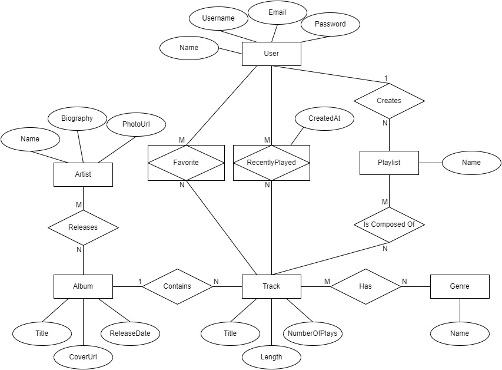
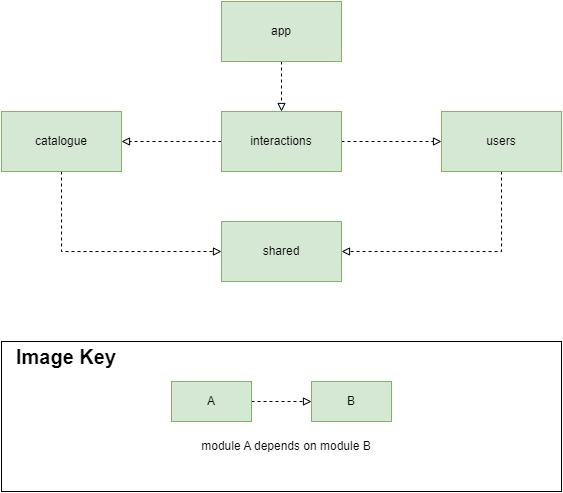
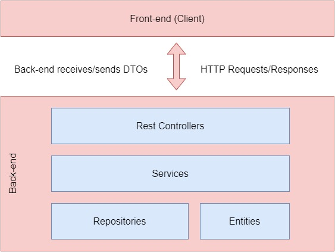
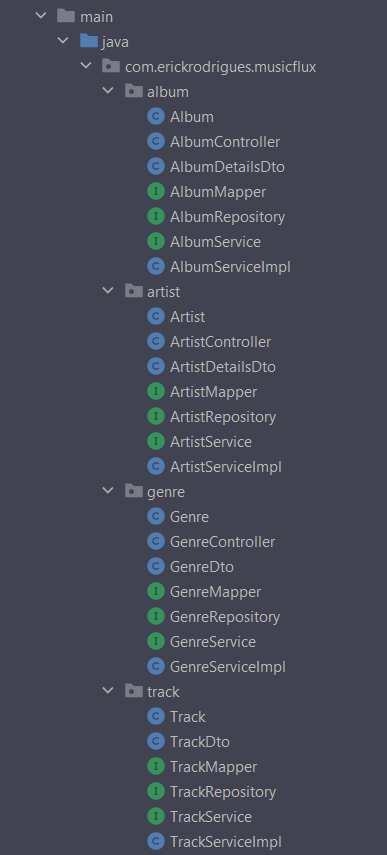

# musicflux's back-end

## How to execute

### Running application

Create a `.env` file with the variables that are in the `.env.sample` file.

With docker/docker-compose installed, you need to start the database:

```shell
docker-compose up
```

There are some options to run the application. Below we describe two of them:

1) With maven installed locally, run the following commands:
    ```shell
    mvn clean package
    java -jar app/target/app-0.0.1-SNAPSHOT.jar
    ```

2) Using maven wrapper inside this repo, run the following commands:
   ```shell
   ./mvnw clean spring-boot:run
   ```

### Running tests

We describe two options to run unit tests:

1) With maven installed locally, do as follows:
   ```shell
   mvn clean test
   ```

2) Using maven rapper inside this repo, do as follows:
   ```shell
   ./mvnw clean test
   ```

If you want to run integration/end-to-end tests with the unit ones, you just have to replace the `test` word to `verify` in the commands above.

## Technologies stack

This back-end uses the technologies stack below:

- Java 19
- Spring Boot
  - Spring Web
  - Spring Data JPA
  - Spring Security
  - Bean Validation API
  - Project Lombok
  - MapStruct
  - Json Token (JWT)
  - MySQL database
  - H2 database (for tests)
  - Swagger
  - JUnit 5

## Back-end architecture

### Rest API

To access the back-end API, go to [this link](http://localhost:3333/api/v1/swagger-ui/index.html) after starting up the application.

### Entities diagram



### Modules dependency diagram

It is described in Figure below the java modules dependency in this project.



Below is each module's responsibility:

- `app`: it contains the main class and the configuration classes such as security config, global api error handler, and so on.
It also contains the integration/end-to-end tests.
- `interactions`: it contains all the classes responsible for handling the operations that can be performed by a user.
Here, we have the CRUD operations for playlists, user's favorites, user's recently played tracks, and searching.
- `catalogue`: it contains the catalogue of artists, albums, tracks and genres that can be accessed by a user.
- `users`: it deals with CRUD operations related to users, as well as users' authentication/authorization.
- `shared`: it contains base and utility classes that can be used by any module.

### Project structure

The application follows the `controller, dto, service, repository and entity` convention, described in the image below:



The package structure adopted in this project by the majority of the modules is guided by entities or functionalities, rather than
the common package structure `entities, controllers, services, dtos, repositories`. As an example, figure below shows the packages and files
inside the `catalogue` module. In it, we have `album`, `artist`, `genre` and `track` packages, with all the files related to each entity
inside the same package.


